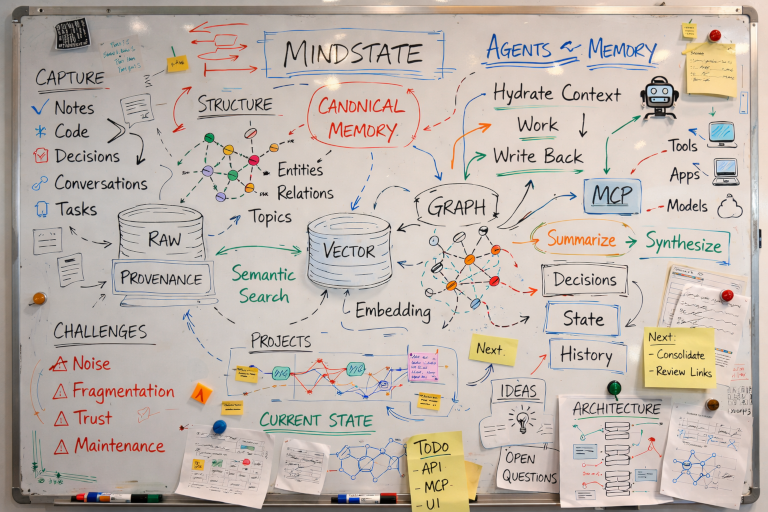

# MindState


MindState is an external memory system for AI-assisted engineering work. It gives coding agents — and you — a shared, inspectable, persistent memory across tools and sessions.



---

## The Problem It Solves

Every AI tool keeps its own fragment of context. Claude knows what you discussed in that project. Your coding agent knows what it changed this session. Your notes app knows the decision you wrote down last week. None of them talk to each other. You re-explain everything, constantly.

MindState moves memory outside any single tool — into a store you own — and exposes it through a compact interface that agents and humans can both use. The idea is developed in more depth in: [From Open Brain to MindState: An Experiment in External AI Memory](docs/From%20Open%20Brain%20to%20Mindstate%3A%20An%20Experiment%20in%20External%20AI%20Memory.md).

---

## What's Inside

One application, three interfaces, one data layer:

| Interface | Command | Who uses it |
| --- | --- | --- |
| MCP server | `mstate-mcp` | Coding agents (Claude Code, Copilot, Codex) |
| HTTP API | `mstate-api` | Scripts, services, other integrations |
| REPL / TUI | `mstate` / `mstate --tui` | You, directly |

All three interfaces call the same service layer. There is no MCP-only logic, no API-only logic. Memory written from one interface is immediately visible through all others.

**Data layer:** PostgreSQL 18 + Apache AGE (graph, openCypher) + pgvector (semantic embeddings) — all bundled in one container image.

---

## How Memory Works

MindState uses a **two-tier write model**:

**Tier 1 — always, fast, no LLM:** `remember()` stores the item, chunks it, embeds it. RAG is immediately available. No LLM on the write path.

**Tier 2 — optional, async, LLM-assisted:** `contextualize()` extracts entities from the content, resolves them against the knowledge graph, infers typed relations, and writes them to Apache AGE. This enriches the item structurally without blocking the write.

Tier 2 runs in the background. If it fails, the Tier 1 item remains fully searchable. High-value memory kinds (`decision`, `architecture_note`, `resolved_blocker`, `task`, `observation`, `claim`) trigger Tier 2 automatically.

### Memory kinds

The kind of a memory item determines how it is stored, whether it is auto-contextualized, and how it surfaces in retrieval:

| Kind | Auto-contextualized | Typical use |
| --- | --- | --- |
| `decision` | Yes | Architectural or design choices |
| `architecture_note` | Yes | Structural observations about the codebase |
| `resolved_blocker` | Yes | Problems that were fixed and how |
| `task` | Yes | Discrete work items |
| `observation` | Yes | Meaningful discoveries during work |
| `claim` | Yes | Assertions you want to track |
| `note` | No | Freeform notes, transient observations |
| `summary` | No | Work session or topic summaries |
| `work_session` | No | Structured session logs |
| `message` | No | Communications or outputs |

---

## The Three Interaction Moments

Agent memory is most useful at three specific moments:

### 1. Start of task — hydrate context

Before starting work, retrieve what's relevant. Don't dump everything — request a bounded context bundle shaped around your task:

```text
\context implement caching layer for the API
```

or via MCP:

```json
{ "tool": "build_context", "query": "caching layer", "source": "myrepo", "limit": 10 }
```

### 2. During work — write selectively

Not every thought deserves memory. Write decisions, blockers, architectural observations. Skip intermediate reasoning traces.

```text
\remember decision | Use Redis for session caching — Memcached ruled out due to no pub/sub support
```

### 3. End of session — log what changed

A structured session record gives future agents state, not fragments:

```json
{
  "tool": "log_work_session",
  "repo": "myrepo",
  "branch": "feature/caching",
  "task": "implement API caching",
  "summary": "Added Redis-backed cache middleware with TTL per endpoint",
  "decisions": ["Redis over Memcached", "TTL=300s for user endpoints"],
  "resolved_blockers": ["Connection pool exhaustion fixed by maxconn=20"],
  "files_changed": ["middleware/cache.py", "config/redis.py"],
  "next_steps": ["Add cache invalidation on writes", "Load test under burst traffic"]
}
```

`log_work_session` stores the session item and automatically creates child `decision` and `resolved_blocker` memory items — each of which triggers graph contextualization.

---

## Quick Start

### 1. Start the database

```bash
podman build -t mindstate-pg .
bash run_db_container.sh
```

The image bundles PostgreSQL 18, Apache AGE, and pgvector. The init script creates the `mindstate` graph and enables both extensions automatically.

### 2. Install

```bash
uv sync
```

### 3. Configure

Create `.env` (copy from `example.env`):

```bash
# Database
PGHOST=localhost
PGPORT=5432
PGDATABASE=postgres
PGUSER=postgres
PGPASSWORD=secret
AGE_GRAPH=mindstate

# LLM — required for semantic features and graph contextualization
OPENAI_API_KEY=your_api_key_here
OPENAI_MODEL_NAME=gpt-4.1
OPENAI_TEMPERATURE=0

# Embeddings — used by remember() and recall()
MS_EMBEDDING_PROVIDER=openai          # local | openai | azure_openai
MS_EMBEDDING_MODEL=text-embedding-3-small
MS_EMBEDDING_DIMENSIONS=1536

# HTTP API
MS_API_HOST=127.0.0.1
MS_API_PORT=8000

# MCP server
MS_MCP_TRANSPORT=stdio               # stdio (default) | sse
MS_MCP_HOST=127.0.0.1               # used only when transport=sse
MS_MCP_PORT=8001                     # used only when transport=sse
# MS_MCP_ENABLED_TOOLS=remember,recall,build_context   # restrict tool surface

# Graph contextualization (Tier 2)
MS_CONTEXTUALIZE_ENABLED=true
MS_AUTO_CONTEXTUALIZE_KINDS=decision,architecture_note,resolved_blocker,task,observation,claim
MS_CONTEXTUALIZE_CONFIDENCE_THRESHOLD=0.85
MS_CONTEXTUALIZE_MERGE_THRESHOLD=0.92
MS_CONTEXTUALIZE_MAX_ENTITIES_PER_ITEM=12
```

> **No OpenAI key?** Set `MS_EMBEDDING_PROVIDER=local` and `MS_CONTEXTUALIZE_ENABLED=false` for a local-only mode. Recall works with deterministic embeddings (lower quality but no API required).

### 4. Run

```bash
# For agent integration (primary usage)
uv run mstate-mcp

# HTTP API
uv run mstate-api

# Interactive REPL
uv run mstate

# Textual TUI
uv run mstate --tui
```

---

## MCP Server

`mstate-mcp` starts a stdio MCP server. Point any MCP-compatible agent at it:

**Claude Code** — add to `.claude/settings.json` or project settings:

```json
{
  "mcpServers": {
    "mindstate": {
      "command": "uv",
      "args": ["run", "mstate-mcp"],
      "cwd": "/path/to/mindstate"
    }
  }
}
```

### MCP tools

| Tool | What it does |
| --- | --- |
| `remember` | Store a typed memory item. Kind determines auto-contextualization. |
| `recall` | Semantic search. Returns ranked items with similarity scores. |
| `build_context` | Fetch a bounded context bundle for a task — summaries, decisions, related items. |
| `contextualize` | Trigger graph enrichment for recent or specific items. |
| `log_work_session` | Store a structured work session with child decisions and resolved blockers. |
| `find_related_code` | Repo-scoped semantic + decision lookup for a symbol, path, or concept. |
| `get_recent_project_state` | Latest summaries, decisions, and open blockers for a repo. |

### Tool examples

**Store a decision:**

```json
{
  "tool": "remember",
  "kind": "decision",
  "content": "Use connection pooling via pgbouncer in production — direct connections exhausted under load",
  "source": "myrepo",
  "source_agent": "claude-code"
}
```

→ Returns `memory_id` and `contextualization_job_id` (auto-triggered because `decision` is in `AUTO_CONTEXTUALIZE_KINDS`).

**Retrieve context before starting a task:**

```json
{ "tool": "build_context", "query": "auth middleware session handling", "source": "myrepo" }
```

→ Returns overview, ranked supporting items, linked decisions, provenance references.

**Trigger graph enrichment manually:**

```json
{ "tool": "contextualize", "n": 5 }
```

→ Queues the 5 most recent un-contextualized items. Returns `job_id` immediately.

---

## HTTP API

```bash
uv run mstate-api
# → http://127.0.0.1:8000
# → http://127.0.0.1:8000/docs  (Swagger UI)
```

### Endpoints

| Method | Path | What |
| --- | --- | --- |
| `POST` | `/v1/memory/remember` | Store memory item |
| `POST` | `/v1/memory/recall` | Semantic search |
| `POST` | `/v1/context/build` | Build context bundle |
| `POST` | `/v1/memory/contextualize` | Queue contextualization job |
| `GET` | `/v1/memory/contextualize/{job_id}` | Poll job status |
| `POST` | `/v1/memory/work-session` | Store structured work session |

**Example — log a work session:**

```bash
curl -X POST http://127.0.0.1:8000/v1/memory/work-session \
  -H "Content-Type: application/json" \
  -d '{
    "repo": "myrepo",
    "branch": "main",
    "task": "implement auth",
    "summary": "Added JWT middleware and role-based access checks",
    "decisions": ["Use JWT access tokens, 1h TTL"],
    "resolved_blockers": ["Redis connection pool exhaustion fixed"]
  }'
```

---

## REPL and TUI

The REPL and TUI share the same slash-command parser.

```bash
uv run mstate        # CLI REPL
uv run mstate --tui  # Textual TUI
```

### Slash commands

| Command | What |
| --- | --- |
| `\h` | Help — list all commands |
| `\q` | Quit |
| `\mode shell` | Default mode: natural language / Cypher queries via LLM |
| `\mode memory` | Auto-store every line you type as a `note` memory item |
| `\remember KIND \| CONTENT` | Store a specific memory item |
| `\recall QUERY` | Semantic search |
| `\context QUERY` | Build context bundle for a task |
| `\contextualize [n]` | Contextualize the n most recent items (default 1) |
| `\contextualize --id UUID` | Contextualize a specific item |
| `\inspect MEMORY_ID` | Show full detail for a stored item |
| `\llm [on\|off]` | Toggle LLM-assisted mode |
| `\log [on\|off]` | Toggle SQL query logging |

### Workflow example

```text
mstate> \context implement caching layer
→ Overview: Context built for 'implement caching layer' using 4 supporting memory item(s).
  [shows recent decisions, related notes, provenance]

mstate> \remember decision | Use Redis for session caching — TTL 300s per endpoint
→ Stored memory:abc123  (contextualization job queued)

mstate> \contextualize 3
→ Queued 3 items  job_id:xyz789

mstate> \recall Redis connection
→ [ranked results with similarity scores]
```

**Screenshots:**

*CLI REPL*


*Textual TUI*


---

## Project Layout

```text
mindstate/          Core application
  mcp/              MCP server and tool adapters
  memory_service.py Service layer (MindStateService)
  memory_db.py      Database operations
  memory_models.py  Input/output data models
  contextualizer.py Graph contextualization pipeline
  api.py            FastAPI HTTP interface
  cli.py            REPL / TUI entry point
  config.py         Settings and environment variables

tests/              Unit and integration tests
openspec/           Spec-driven change artifacts (design docs, specs, tasks)
docs/               Design notes and background reading
Dockerfile          PostgreSQL 18 + AGE + pgvector image
```

---

## Principles of Participation

Everyone is welcome: open issues, propose pull requests, share ideas, improve docs.
Participation is open to all, regardless of background or viewpoint.

This project follows the [FOSS Pluralism Manifesto](./FOSS_PLURALISM_MANIFESTO.md), which affirms respect for people, freedom to critique ideas, and space for diverse perspectives.

---

## License and Copyright

Copyright (c) 2025, 2026 Iwan van der Kleijn

Licensed under the MIT License. See [LICENSE](LICENSE) for details.

Components: PostgreSQL, Apache AGE, and pgvector are open source and bundled here for a smooth graph + vector + LLM memory workflow. If you build something interesting with this, open a PR or file an issue to share it.
